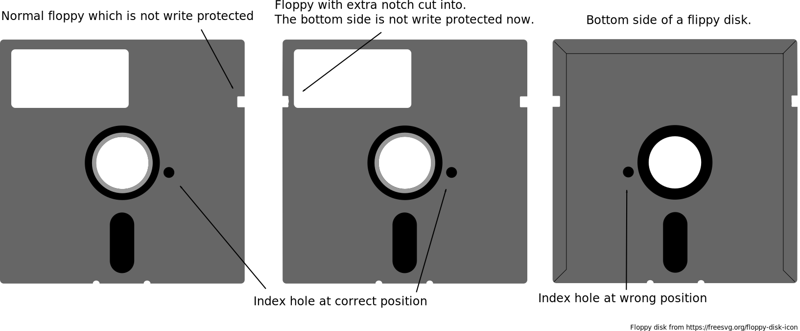

# Flippy Disk Index Simulation

## What is this about?

This project intends to use PC drives to write 5.25" floppy disks. While a double headed drive for PC usage is capable of
writing a double sided disk, writing a flippy disk is a different story.
Flippy disks are double sided disks handled in a single headed drive. The bottom side is accessed by inserting the disk flipped upside down.
The implication is that the bottom side rotates in the opposite direction.
This means that the bottom side of a flippy disk can't be written using the bottom head of a double sided drive. The signal would be in reverse.

**We have to write the bottom side using the top head!**

## Why not just insert the disk flipped then?

One might guess that notching a disk might be all that is needed. It did work in the past with the 1541 drive after all.
But the 1541 has ignored the index hole and therefore it did work.
PC drives - at least the ones on my desk here - behave differently and refuse to work without an index signal.

In these pictures it is visible that, while the write protection notch is fixable with some tools, the index hole is still missing.
If the disk is inserted the other way around, the STM32 will never get an index pulse from the drive and therefore will never start working.
The reason is the single light sensor and an asymmetrical floppy disk design.

It should be noted that official flippy disks have a second index hole in the case. But these are rare.

## What can we do?

This project offers a simulated high active pulse (3ms in length) on pin PA1 with a frequency of 6 Hz.
This fits the rotation speed of PC 5.25" drives that are rotating at 360 RPM.
The signal can be used with a NPN transistor and a series resistor to drain the output of the photo diode of the drive to simulate the index pulse.

A mod could look like this:

With this mod being performed, the tool can be instructed to utilize it.
Let's say, we want to replicate a Katakis disk with both sides.

Insert the disk non flipped and write Side 1:

    usbfloppytracer -b 'katakis_s1[rainbow_arts_1988](r1)(!).g64'

Then flip the disk and write Side 2 with an additional parameter:

    usbfloppytracer -b 'katakis_s2[rainbow_arts_1988](r1)(!).g64' -f 0

The parameter of `-f` increases the frequency of the simulated index pulse slightly. This is required as some drives
are faster or slower and we need to catch the next rotation for verification. This also means that flipped
writing will fail more often as fluctuations in the rotation might result into not finding the written data.
The parameter should be in a range between 0 and 7. Experimentation is required.
