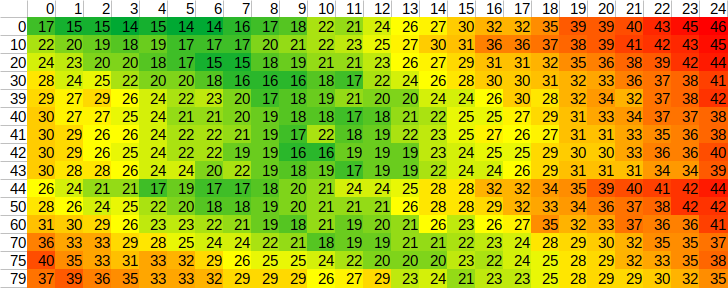
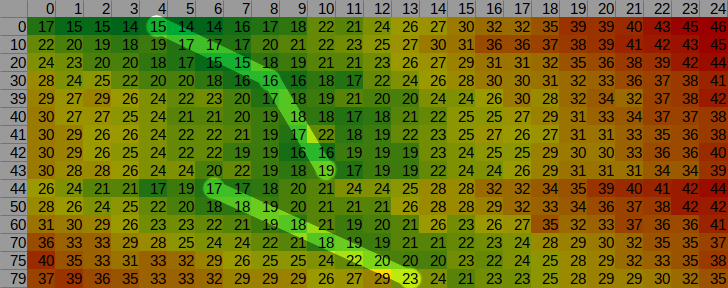

# Write Precompensation

## What is this?

There is a certain phenomenon with floppy disks because of the nature how they are used in the drive.
Usually the disks rotate with a constant angular velocity (300 - 360 RPM) as opposed to a compact disc which rotates at a constant linear velocity.
This however causes the linear velocity to decrease when stepping in. For the drive head, this makes writing on the inner tracks more difficult as the flux reversal are more cramped together if the recording frequency is not decreased.

The effect this has on the data is that flux reversals "want to keep distance and move apart".

Some floppy formats, like the one used by the Commodore 1541, use [Zone Bit Recording](https://de.wikipedia.org/wiki/Zone_Bit_Recording) to decrease the frequency on the inner tracks. So writing a Commodore C64 disk is not prone to this problem.

The [Wikipedia](https://en.wikipedia.org/wiki/Write_precompensation) article might provide more explanation about this.

**tl;dr: Use write precompensation to increase the quality of the written data.**

## Do I even need this?

In short, No.
Usually "modern" Floppy drives have integrated electronics for a factory side calibration. They do write precompensation on their own.

But certain images are recorded at a non-standard frequency and the calibration is not designed to handle these.
Games like "Turrican 2" for the Amiga have a pretty close distance of flux reversals and it is not guaranteed that your drive is capable of writing it without precompensation.

## How to calibrate the drive?

You need a disk to write to which is used for writing and reading back the data.
You also need an image to write. The precompensation is then evaluated using the provided track data.
Insert the disk an then:

    usbfloppytracer -w -a Turrican2.ipf

It will take about 3 minutes to finish as every cylinder is carefully measured with multiple different write precompensation configurations. In the end a [wprecomp.csv]{wprecomp.csv} file is created.
This can be loaded into your favourite spreadsheet tool and colorized according to the value.
This is my result after I did this process with Turrican2.ipf:

What do we see here? The rows are the cylinders we have used for calibration. The columns are the write precompensation values in steps of 11.9ns per digit.
The data values inside represent the maximum error (also 11.9ns per digit) in this tuple of track and write precompensation.
There are multiple things to learn from this.

* When no write precompensation is applied, the error rises the more inward the cylinder is.
* Also the more inward a cylinder is, the higher must the write precompensation be to correct that error.
* With this particular 3.5" drive made by Sony, there is a precompensation performed by the drive starting with cylinder 44.

We really want to consider all of this and calibrate our processes using this data.

## How to configure the write precompensation

This tool expects a configuration in your home directory stored in `~/.usbfloppytracer/wprecomp.cfg`

    mkdir -p ~/.usbfloppytracer/
    touch ~/.usbfloppytracer/wprecomp.cfg

An example for such a file is provided as [sample_wprecomp.cfg]{sample_wprecomp.cfg}.
The content looks like this:

    # This is a comment.
    151  0  4
    151 30  8
    151 43 10
    151 44  6
    151 75 13

Every line provides one sample in a 2D grid of calibration.
The first value is the bit cell width in 11.9ns per digit.
The second value is the cylinder. The third is the desired write precompensation value.
If no value exists for a certain cylinder or bit cell width, bilinear interpolation is performed to find one.
Let us draw these values as lines onto our precompensation statistics.

This is a very manual process. But it has to be done only once and afterwards the results should be much better.
